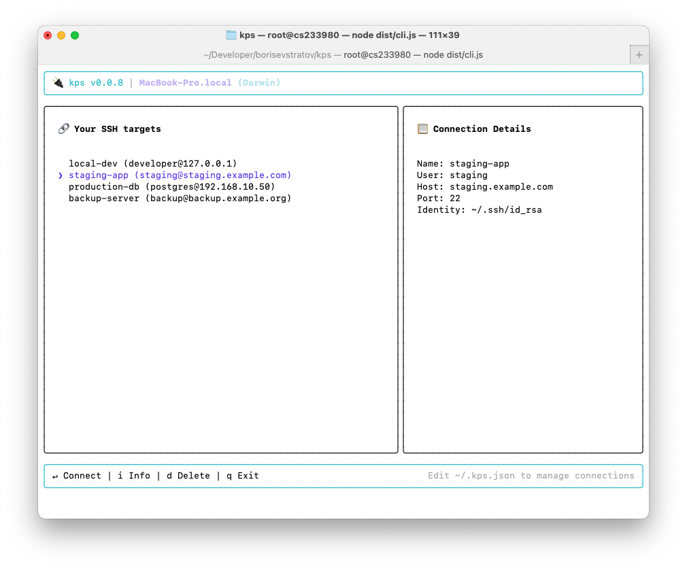

# kps

A terminal-based SSH connection manager.



## Features

- List and select SSH targets from a configuration file.
- Connect to SSH targets.
- View connection details.

## Requirements

- Node.js >= 16

## Installation

Install with npm

```bash
npm install -g @borisevstratov/kps
```

Then run

```bash
kps
```

## Configuration

Connections are managed by editing the `~/.kps.json` file.

This file would be auto-generated from `~/.ssh/config` at the first run.

It contains an array of connections:

```json
{
  "connections": [
    {
      "name": "local-dev",
      "user": "developer",
      "host": "127.0.0.1",
      "port": 22,
      "identity": "~/.ssh/id_rsa"
    },
    {
      "name": "staging-app",
      "user": "staging",
      "host": "staging.example.com",
      "port": 22,
      "password": "12~am_GHDw$"
    }
  ]
}
```
